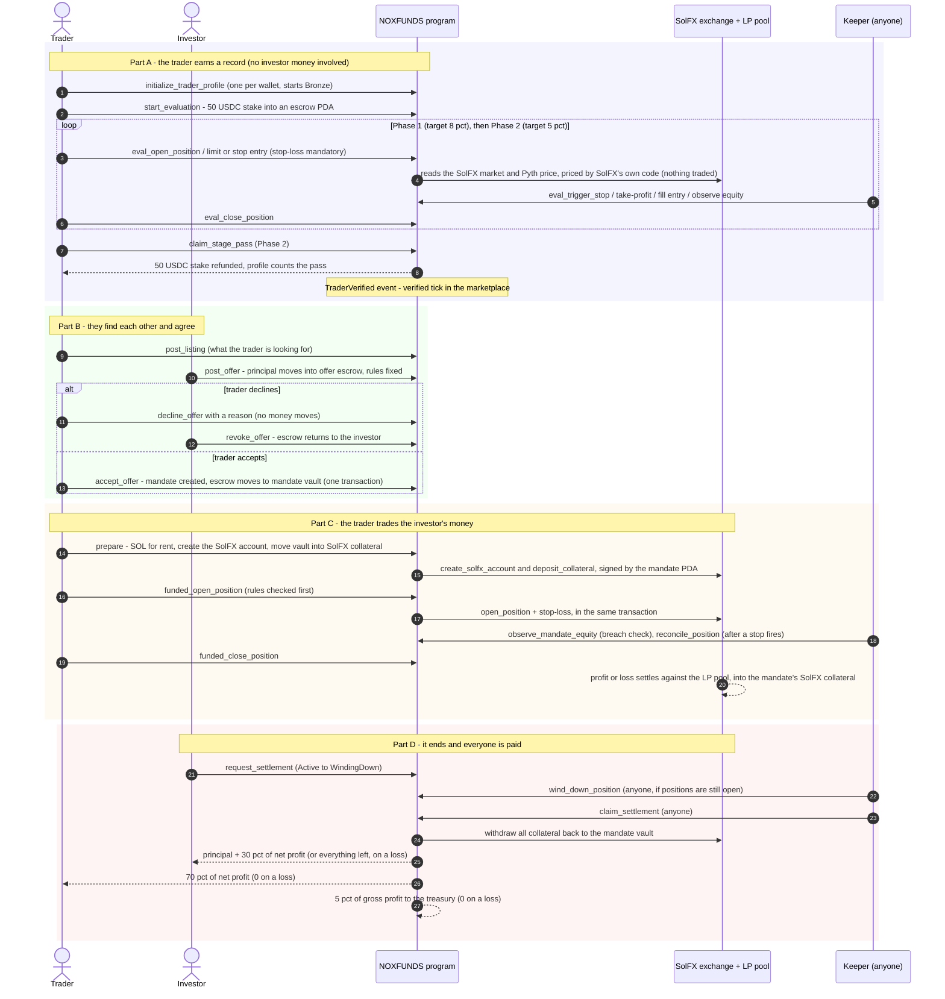

# 0 — Start to finish, both sides

Five actors. The **investor** and **trader** are wallets. **NOXFUNDS** is the rules program and
holds custody through PDAs. **SolFX** is the exchange it trades on, where the LP pool takes the
other side of every trade. The **keeper** is a bot anyone could run; every instruction it calls
is public.

The same story in one line each:

| Step | Who signs | What moves |
|---|---|---|
| Evaluation | trader | 50 USDC stake into escrow, back on a pass, to the treasury on a fail |
| Offer | investor | the whole principal, investor's USDC account → offer escrow |
| Accept | trader | escrow → mandate vault. Trader pays the account rent |
| Prepare | anyone (the trader's page) | mandate vault → SolFX collateral |
| Trade | trader | collateral ↔ position margin. P&L comes from or goes to the SolFX LP pool |
| Settle | anyone | SolFX collateral → mandate vault → investor, trader, treasury |

The details of each part are in the numbered files that follow.
