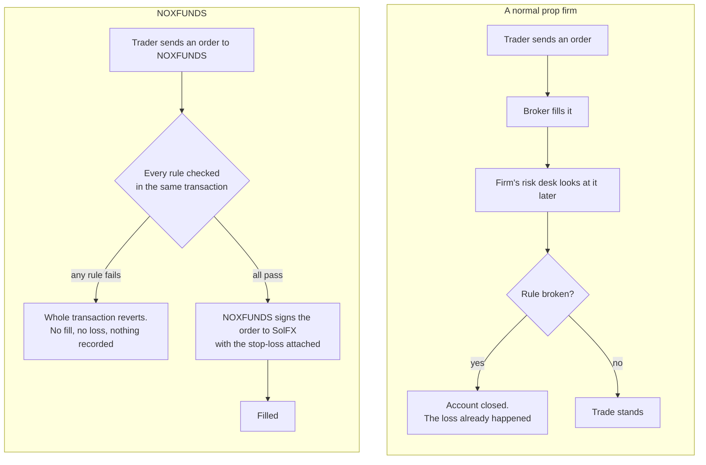
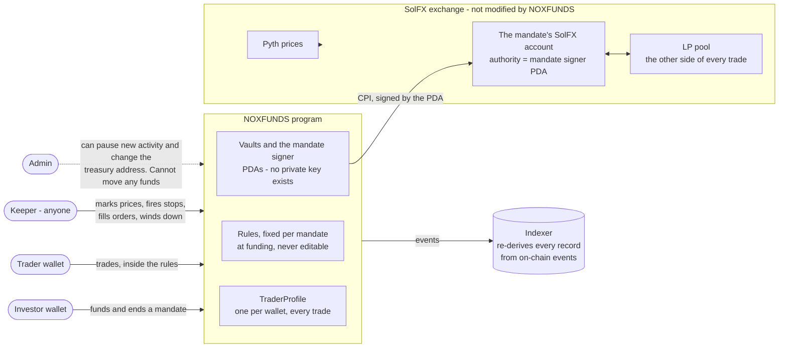

# 1 — What makes it different

## A normal prop firm checks the rules after the trade. NOXFUNDS checks them before.

This works because a Solana transaction is all or nothing. "Check the rule, then trade" in one
transaction means a trade that fails the check **never existed**.

## The pieces, and who controls what

## The differences, one by one

| | A normal prop firm | NOXFUNDS |
|---|---|---|
| When rules are enforced | after the fill, by a risk desk | **before** the fill, in the same transaction |
| Stop-loss | "please use one" | an order **cannot be sent** without one; it is placed in the same transaction |
| Who holds the capital | the firm's bank account | a vault owned by a PDA. No key exists for it |
| Can the rules change mid-way? | yes, they are a PDF | no. Fields on the mandate, no instruction edits them |
| Is the funded account real? | you cannot check | the vault and SolFX account are public; anyone can read the balance |
| Track record | the firm's database | `TraderProfile`, one per wallet, every trade from every mandate, re-derivable from events |
| If the trader disappears | the firm closes them out | **anyone** can wind down positions and settle; the investor is never stuck |
| Who decides the payout | the firm | a formula in the program, run by whoever calls `claim_settlement` |
| Evaluation fee | lost if you fail | 50 USDC **stake**, refunded in full when you pass |

## Where trust is still required, stated plainly

1. **The program can be upgraded.** Whoever holds the upgrade authority can replace the code.
   Not yet handed to a multisig.
2. **The admin can pause, and (new) change the treasury address** (where future fees and
   forfeited stakes go). Pausing blocks new activity; it does not stop settlement. The admin
   cannot move any funds.
3. **No external audit has been done.** Tests prove what someone thought to test, nothing more.
