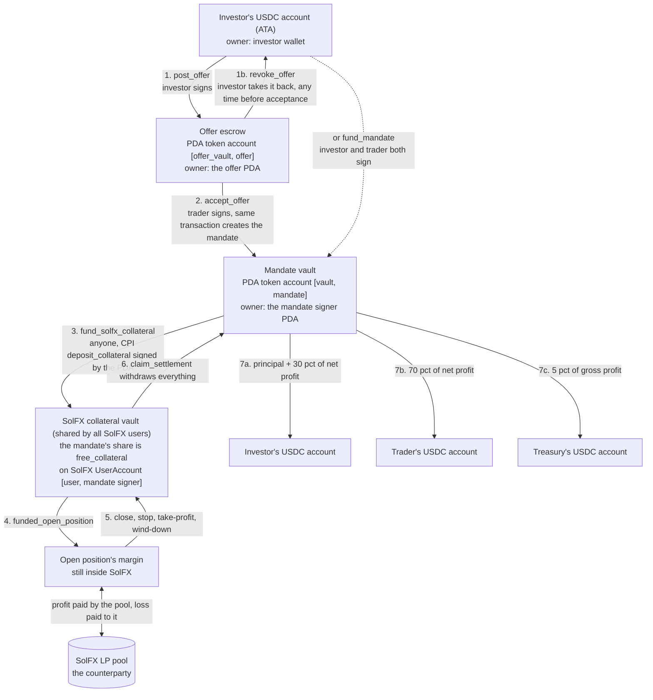
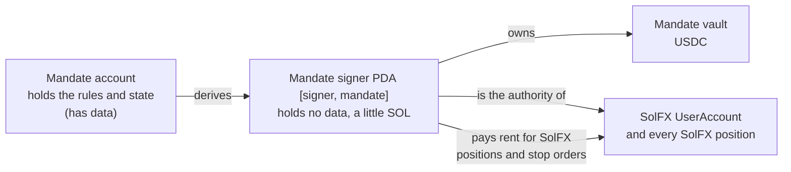
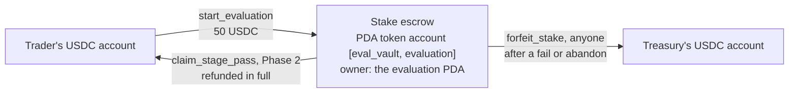

# 2 — Who holds the money, at every moment

The investor's USDC passes through four places and comes out in up to three. At no point is it
in an account that a person holds a key to. The vaults belong to PDAs, and PDAs have no key.

## The path of the investor's USDC

Steps 1 to 3 are the escrow. Steps 4 and 5 are trading. Steps 6 and 7 are settlement, in **one**
instruction. Nothing pays out until every position is closed.

## Who can move it out of each place

| Place | Address (seeds) | Owner | The only ways out |
|---|---|---|---|
| Investor's USDC account | the wallet's ATA | investor | the investor's own signature |
| Offer escrow | `["offer_vault", offer]` | offer PDA | `accept_offer` → mandate vault (trader signs) · `revoke_offer` → back to the investor (investor signs) |
| Mandate vault | `["vault", mandate]` | mandate signer PDA `["signer", mandate]` | `fund_solfx_collateral` → SolFX · `claim_settlement` → the three recorded payees |
| SolFX collateral | the mandate's SolFX account `["user", mandate signer]` | mandate signer PDA | trades (margin and P&L) · `claim_settlement` → the mandate vault. **There is no withdraw instruction for the trader.** |
| Payouts | USDC accounts whose owner is the investor, trader and treasury **recorded on the mandate** | them | theirs |

Two consequences worth reading twice:

- **Who gets paid is fixed when the mandate is created.** `claim_settlement` can be called by
  anyone, but it only accepts payee accounts owned by the investor and trader written on the
  mandate, and the configured treasury. A caller cannot send the money anywhere else.
- **Accept is atomic.** The mandate, its vault and the transfer are one transaction. There is no
  moment where terms are agreed and the money has not moved, or the money moved and there are
  no terms.

## Why a separate "mandate signer" PDA?

SolFX makes the account authority pay rent for new positions, through the System Program, and
the System Program refuses a payer that carries data. So the authority has to be a separate,
dataless PDA. That is why the trader's page has a **prepare** step that tops it up with a little
SOL. After settlement, `sweep_mandate_signer` **(new)** returns whatever SOL is left to the
trader.

## The trader's evaluation stake

The simulated balance ($10,000 to $200,000) is a number on the `Evaluation` account. No real
money backs it and none moves when a simulated trade wins or loses. Only the stake is real.

## Who pays rent (SOL), and gets it back

| Account | Paid by | Returned |
|---|---|---|
| Offer and its escrow | investor | no, they stay as the public record of the negotiation |
| Mandate and its vault | trader on `accept_offer` (investor on `fund_mandate`) | no, it is the permanent record |
| SolFX positions | the mandate signer PDA (topped up by **prepare**) | to the signer when SolFX closes the position, swept to the trader after settlement |
| Evaluation, stake escrow | trader | no, it is the record |
| A simulated position | trader, or the keeper who fills an entry order | to the trader on close |
| A resting entry order **(new)** | whoever places it | to the keeper that fills it, or to the trader on cancel |
