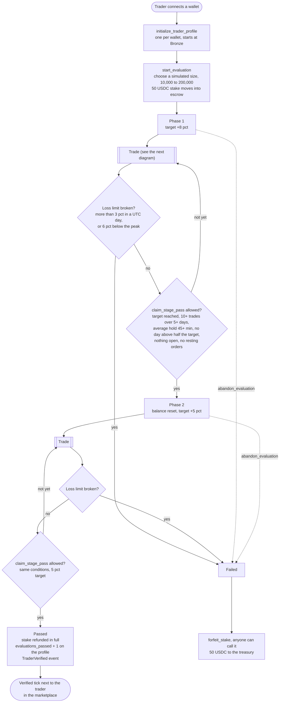
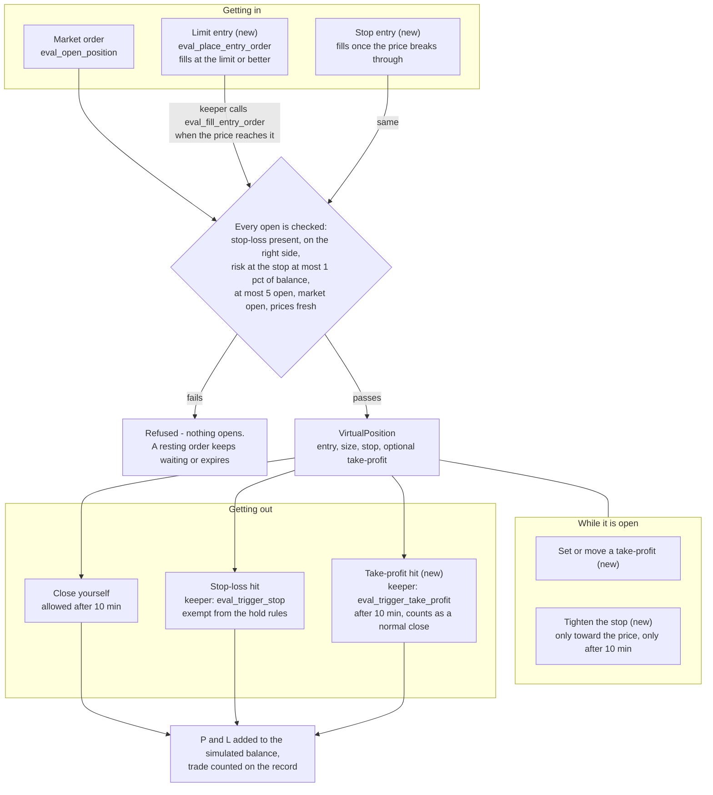
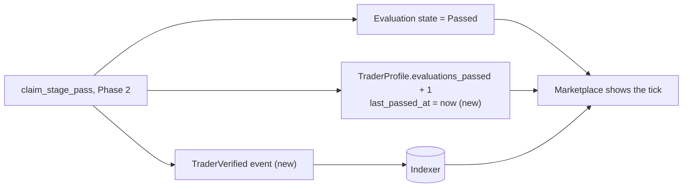

# 3 — The trader's evaluation: Phase 1, Phase 2, and the verified tick

An evaluation is how a trader builds a record **before** anyone risks money on them. The balance
is simulated; only the 50 USDC stake is real. Each simulated trade is priced by SolFX's own code
on the live Pyth price, so a simulated fill and a real one agree to the last unit.

## The whole journey

There is no time limit. The loss limits are judged whenever a close leaves the account flat, and
whenever anyone calls `eval_observe_equity`, which marks every open position to the live price
(the keeper does it every 5 minutes while positions are open). So refusing to close a losing
trade does not hide it.

## One simulated trade, and the orders a trader can use

Why the stop can only be tightened, and only after 10 minutes: a stop-out is exempt from the
hold rules, because a stop is the discipline the rules ask for. If a trader could drag the stop
up to the price in minute one, that exemption would be a way to scalp. Same reason a take-profit
only fires after the 10-minute hold.

## What the verified tick means, and where it comes from

The tick is computed from the chain, not typed in by anyone: an evaluation account in state
`Passed`, or the counter on the trader's profile. The indexer re-derives the same thing from
events, and `/nox/verify` lets anyone check that the two agree.
