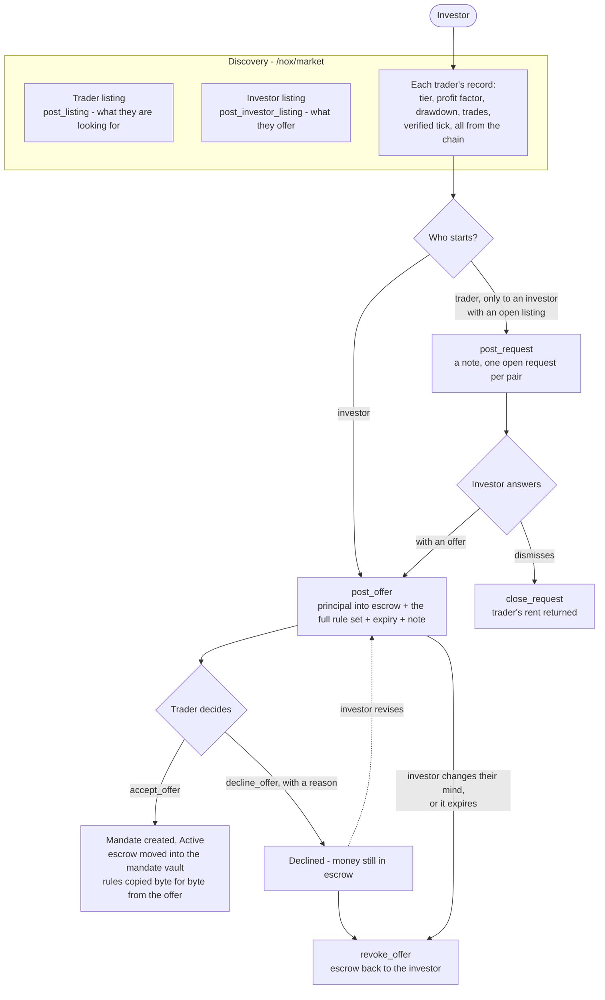
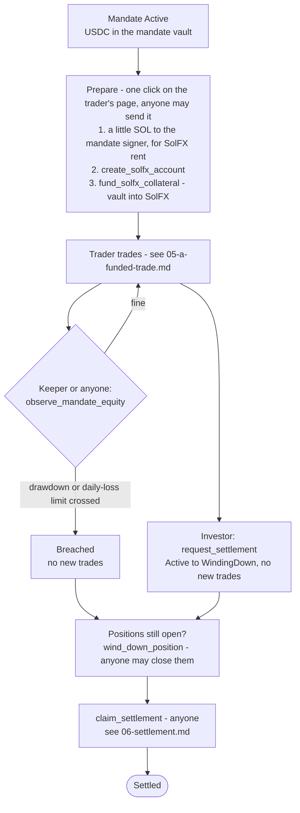
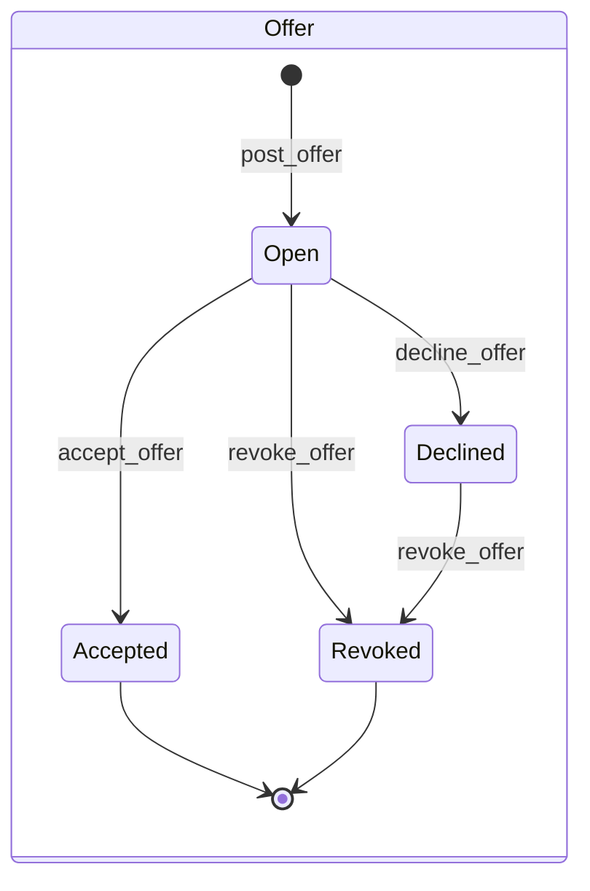
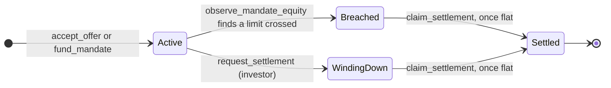

# 4 — The investor's journey: finding a trader, agreeing, funding

There is no chat. Every "message" is a typed on-chain object tied to a real step, carrying a short
note (180 bytes at most). The investor's offer **is** the contract: the money is already in
escrow and the rules are already fixed in it. The trader's acceptance is the signature.

## Finding each other

What this guarantees:

- **The investor can always take the money back until a trader signs.** Declining never moves
  money, and an expired offer cannot be accepted.
- **A request can only reach an investor who has listed**, and only one per trader–investor
  pair. No wallet can be spammed for merely existing.
- **The rules the trader accepts are exactly the rules the investor published.** The program
  copies them from the offer; nobody retypes them.
- A trader can only accept up to their tier's limits: Bronze $10,000 and one mandate at a
  time, up to Platinum $200,000 and five.

## What the investor sets, and can never change afterwards

| Rule on the mandate | What it stops |
|---|---|
| `max_trade_notional` | one oversized bet |
| `max_total_notional` | many bets adding up to one |
| `max_concurrent_positions` | too many open at once |
| `max_risk_per_trade_bps` | a stop so far away it is not a stop (risk measured at the stop, before the fill) |
| `max_stop_distance_bps` | the same, measured in price |
| `max_drawdown_bps`, `max_daily_loss_bps` | trading on after the capital is impaired |
| `allowed_markets` | instruments outside the agreement |
| `min_hold_slots` | scalping (stop-outs exempt) |
| `trader_split_bps` | the trader's share of net profit (70 pct by default) |

There is no instruction that edits any of these. Different rules mean a different mandate.

## After acceptance: prepare, trade, watch, end

The investor never depends on the trader to get the money back. A breached or winding-down
mandate can be closed out and settled by anyone, with neither the trader nor any operator
cooperating.

## The two state machines

`Breached` does not pass through `WindingDown`. That keeps the record of **why** the mandate
ended, which is what the next investor reading this trader's history needs to see.
