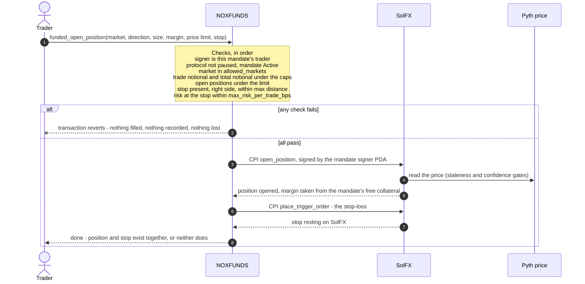
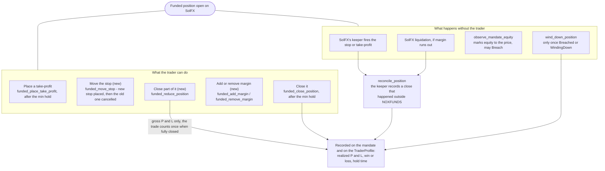
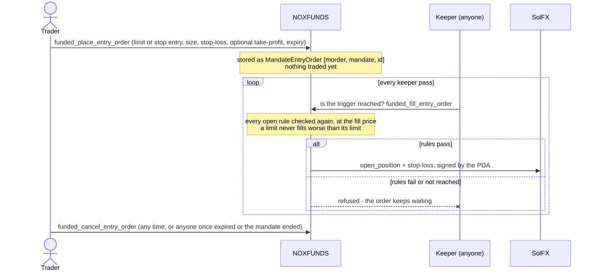

# 5 — One trade on investor money

The trader never talks to the exchange. They sign a transaction **to NOXFUNDS**; NOXFUNDS checks
every rule and only then signs to SolFX, as the mandate's PDA. The trader's signature never
reaches SolFX, so there is no way round the checks.

## Opening: rules, position and stop-loss in one transaction

Risk per trade is the rule a normal prop firm **cannot** enforce: it can only measure your risk
once you already hold the position. Here the stop is part of the same transaction, so the
program knows the worst case before anything fills.

## While it is open, and how it can end

What the trader **cannot** do, because no instruction exists for it: withdraw, change a rule,
change who gets paid, or trade a market the mandate does not allow.

## Resting entry orders on a mandate (new)

An order is a request, not a reservation. If the mandate's equity, open positions or caps have
changed by the time the price arrives, the fill is refused for exactly the reasons a market order
would be.
