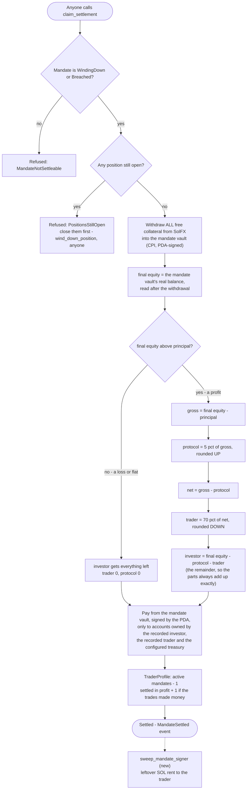

# 6 — How it ends, and who gets paid what

Settlement is one instruction, `claim_settlement`, that **anyone** can call. It takes no
privileged signer, so the investor never waits on the trader or on an operator.

## What `claim_settlement` does



The 5 pct and 70 pct are the defaults (`DEFAULT_PROTOCOL_FEE_BPS = 500`,
`DEFAULT_TRADER_SPLIT_BPS = 7000`). The trader's share is fixed per mandate by the offer; the
fee comes from the protocol config.

## Two worked examples

**A profit.** Principal $3,500, final equity $4,500:

```
gross profit                        $1,000
− protocol fee, 5% of gross         $   50   → treasury
─────────────────────────────────────────
net                                 $  950
  → trader, 70% of net              $  665   → trader
  → investor, principal + the rest  $3,785   → investor
                                    ──────
                                    $4,500   adds up exactly, by construction
```

**A loss — as it actually ran on devnet**, mandate `Bf7aVemJQwTq5trPgqo6t7vjmHy4M3FcxjjHSp1BCyrc`:

```
investor funds            200.000000 USDC
trader opens BTC/USD long, $100 notional, stop 100 bps below entry
trade loses; investor requests settlement; anyone settles
investor receives         199.797874 USDC
trader receives             0
protocol receives           0
```

The protocol never earns from a losing mandate, and the trader is never charged for one. The
investor bears the trading loss; that is what putting up the capital means.

## Rounding, and why it goes this way

| Share | Rounds | Why |
|---|---|---|
| Protocol fee | up | a charge rounds toward whoever charges it |
| Trader | down | a payout rounds down |
| Investor | the remainder | the dust goes to the party whose capital was at risk, and the three always sum to the vault balance |

"In profit" on the trader's record is judged on the **trades** (`realized_pnl`), not on the vault
balance, because anyone can send USDC to a vault. A trader topping up a losing mandate by a
dollar cannot make it count toward Platinum.
